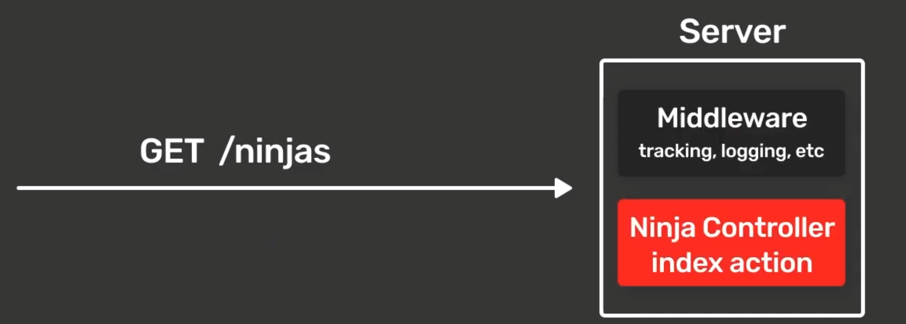
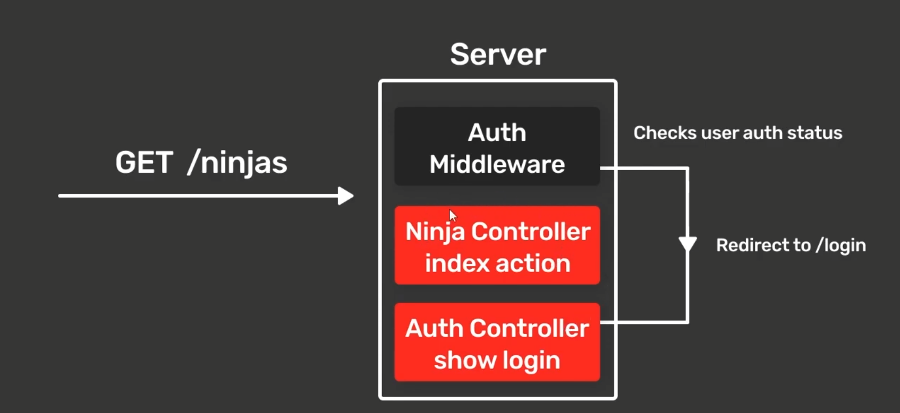

# Notes for this project

## MVC

MVC, is simply code architechture, it is a way to divide code in three parts. Model, View, & Controller.

**Model**: This part of the code is where everything such as logic of the data is worked. it can be any type of data (json or database), here things are stored and managed(the data).

**View**: This part of the code handles the UI(html, css, js). The view interacts with the user, it also showcases the information stored in the model, but doesnt store or process it itself. 

**Controller**: This part of the code is like the brain / processer. it works as a connecter between the View and Model. It handles user trigger / system triggers (such as, button click, data loaded from model, selecting an option from dropdownbar). it detects events, decides what to do, and then tells the model or view how to act.

 
 

## MiddleWare

### What it means
- Run a block of code / a function, for a particular route.

Imagine as shown in the picture a "GET" request is sent into the server at the URL "/product" (random name for the route, ninjas in the photo). 
The Action in the ProductController (is simply the name for the controller where the route is made in is named, is NinjaController in photo.) runs, and it fetches all of Product data it fetched and returns a view with all of the Product data (Ninja data i guess it would be in the figure). 

 
 

With the use of middleware, we can run some whatever code we want to run, before the controller action handles the request.
Once the middleware function has been run, you can let the request move onto the controller action if you want to, and the controller can do what it needs to do.

 
 

But another possibility if the user isnt logged authorized, then the middleware can redirect them to another view instead of the "main" one.
So by using middleware, we can make protected routes, which are only accessable with authorized access.