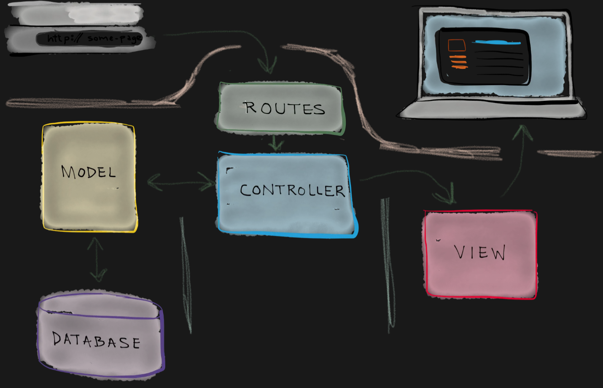
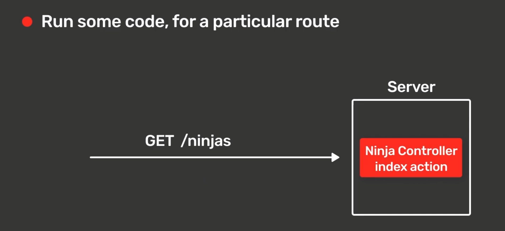

# Notes for this project

## MVC

MVC, is simply code architechture, it is a way to divide code in three parts. Model, View, & Controller.

**Model**: This part of the code is where everything such as logic of the data is worked. it can be any type of data (json or database), here things are stored and managed(the data).

**View**: This part of the code handles the UI(html, css, js). The view interacts with the user, it also showcases the information stored in the model, but doesnt store or process it itself. 

**Controller**: This part of the code is like the brain / processer. it works as a connecter between the View and Model. It handles user trigger / system triggers (such as, button click, data loaded from model, selecting an option from dropdownbar). it detects events, decides what to do, and then tells the model or view how to act.

## MiddleWare

### What it means
- Run a block of code / a function, for a particular route.

